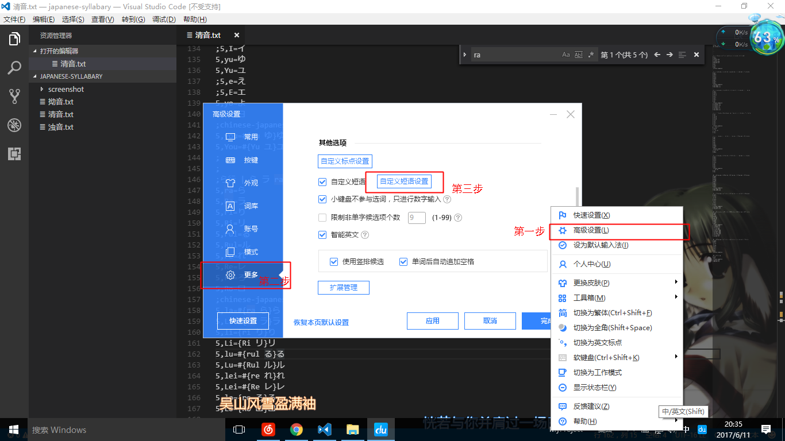
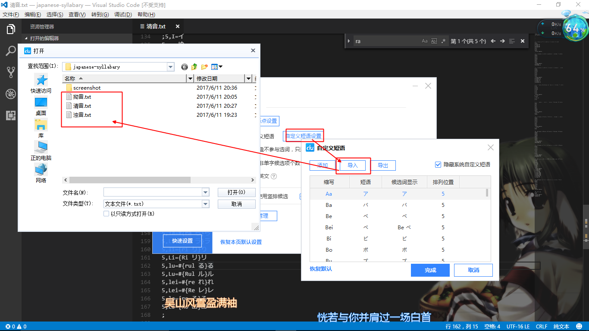
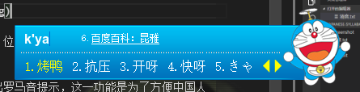
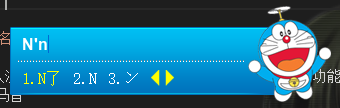

# japanese-syllabary
## 日文假名，导入百度输入法自定义短语里，方便快速输入 

***
## 使用方法

### 一、PC版百度输入法 -> 高级设置 -> 其它选项 -> 自定义短语设置 -> 导入

### 二、输入罗马音，在五号（或末号）预选位置上会出现平假名，如输入 `ka` ，将看到 `か`

### 三、首字母大写的情况下，五号（末号）位出现片假名，如输入 `Ga`，三号位显示 `ガ`

四、输入汉语拼音也是允许的，并会给出罗马音提示，这一功能是为了方便中国人学习罗马音

### 其它、一些特殊的规则：

    发音冲突：じ=ji, ぢ=di, ず=zu, づ=du, ぢゃ=dya, ...
    输入法冲突：い=yi, う=wu, ア=Aa, イ=Yi, ウ=Wu, エ=Ee, オ=Oo, ン=Nn,
    坳音拼音：ゃ=yia, ゅ=yiu, ょ=you, ャ=Yia, ュ=Yiu, ョ=You,

***
## 一些提示

自己整理，自用分享，可能有错误或可改进之处，欢迎指出，大家共同交流

百度输入法开启假名软键盘后，可以直接键入假名，忘了怎么读的时候可以用

百度输入法简繁体切换，默认快捷键是 `Ctrl + Shift + F`，可以用来输入一些汉字
